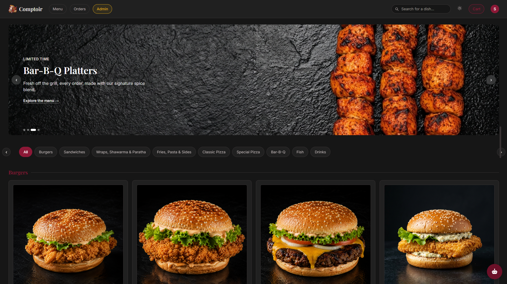
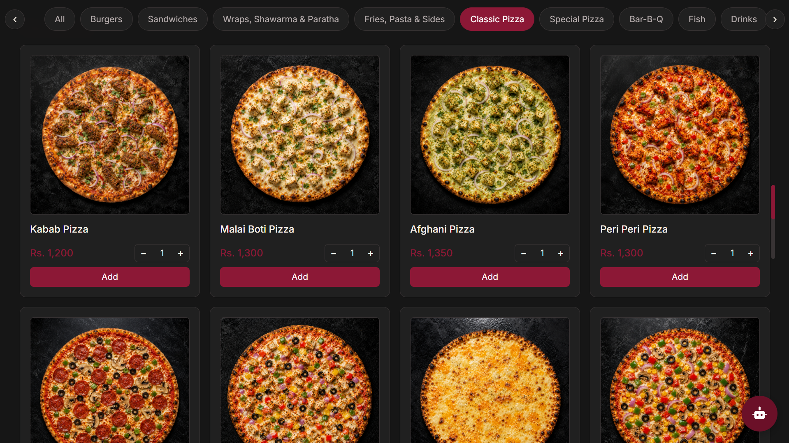
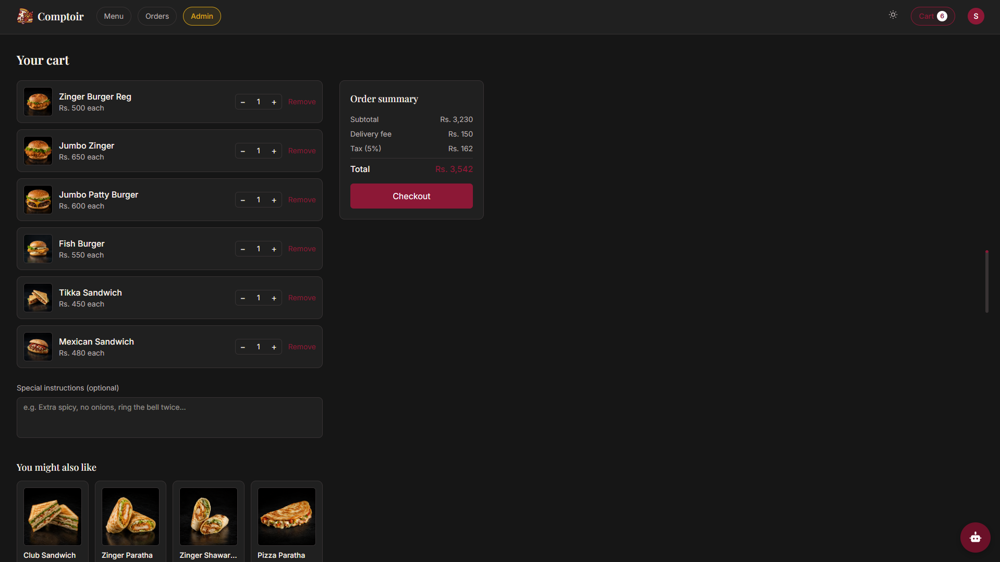
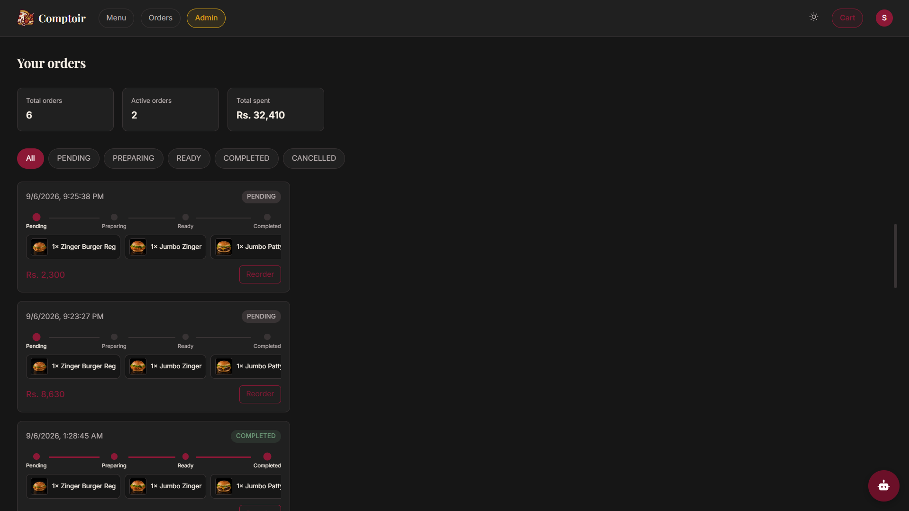
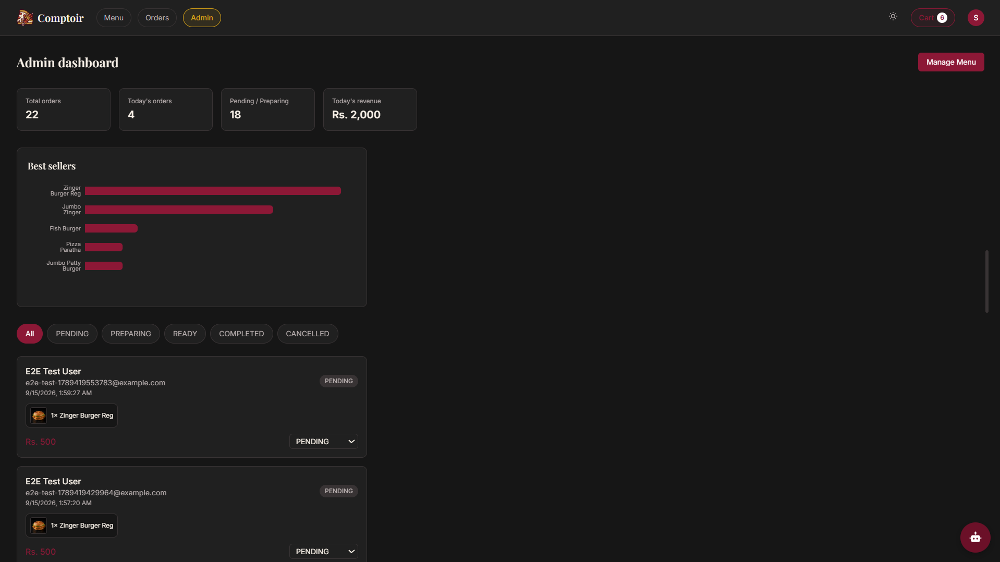
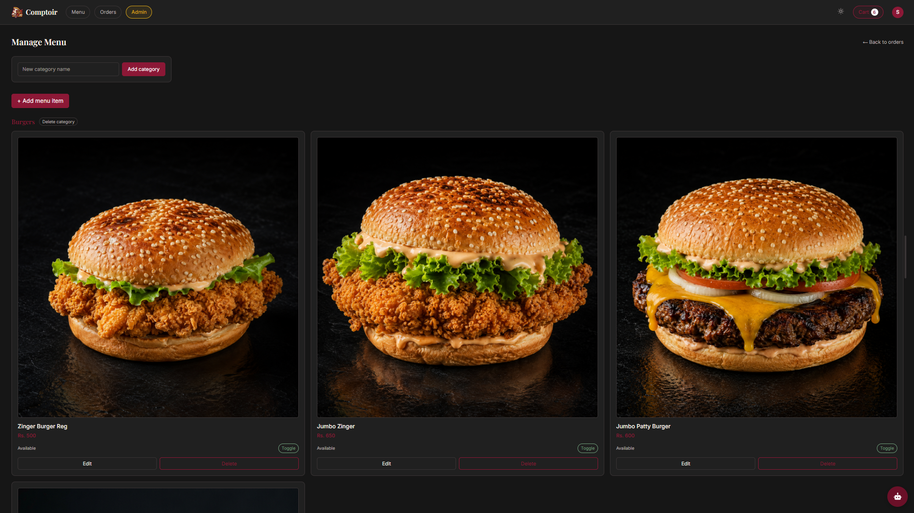

<div align="center">

# 🍽️ Comptoir — Modern Restaurant Ordering Platform

**Browse the menu, order in seconds, and track your food in real time — a full online ordering platform for restaurants, built end-to-end from scratch.**

[](https://react.dev)
[](https://www.typescriptlang.org)
[](https://www.apollographql.com)
[](https://supabase.com)
[](https://prisma.io)
[](https://stripe.com)
[](https://socket.io)
[](https://www.docker.com)

</div>

---

## 🚀 Live Demo

**[View Comptoir →](#)** *(https://comptoir-food.vercel.app/)*

---

## 📸 Screenshots

| Menu — Light Mode | Menu — Dark Mode | Cart |
| :---: | :---: | :---: |
|  |  |  |

| Order Tracking | Admin Dashboard | Admin Menu Management |
| :---: | :---: | :---: |
|  |  |  |

---

## ✨ Features

- 🍔 **Full Ordering Flow** — Browse menu without logging in, add to cart, checkout via Stripe, track status live — exactly like Toast or Square
- 🔐 **Auth System** — Email/password registration and login with JWT sessions and bcrypt password hashing
- 🔎 **Live Search & Categories** — Real-time menu search, category filtering with scroll-spy navigation, an "All" view that scrolls through every category at once
- 🛒 **Smart Cart** — Quantity counters, live order summary (subtotal, delivery fee, tax), special instructions, "you might also like" recommendations
- 📡 **Real-Time Order Tracking** — Live status updates (Pending → Preparing → Ready → Completed) via Socket.IO, with an animated progress stepper and a one-click Reorder button
- 🖥️ **Admin Dashboard** — Live stats, status filters, best-sellers chart, and full menu CRUD (categories, items, images) with direct Cloudinary uploads
- 💳 **Stripe Checkout** — Real hosted checkout sessions generated from cart contents (test mode)
- 🌗 **Dark Mode** — Full theme system with a custom burgundy/wine palette, persisted across sessions
- 🤖 **AI Chatbot Widget** — Embedded, theme-aware assistant (built as a separate project, [ChatSpark AI](https://github.com/Samiullah-2004/Chatspark-ai)) that auto-matches the site's light/dark mode
- 🎬 **Motion & Micro-interactions** — Framer Motion throughout: shared-layout product modals, a 3D physics-based preloader (react-three-fiber), hover-flip nav links, animated everything
- 📱 **Fully Responsive** — Rebuilt from the ground up for phones, tablets, laptops, and large monitors
- 🧪 **Fully Tested** — Vitest unit tests, Supertest integration tests, and Playwright end-to-end tests covering the full purchase flow
- 🐳 **Dockerized** — Backend and frontend each containerized, with a Docker Compose setup for local development
- ⚙️ **CI/CD** — GitHub Actions pipeline: tests → build → end-to-end tests, running automatically on every push

---

## 🛠️ Tech Stack

| Technology | Purpose |
|---|---|
| **React 19 (Vite)** | Frontend framework |
| **TypeScript** | Type safety everywhere |
| **Tailwind CSS v4** | Utility-first styling, custom theme tokens |
| **Framer Motion** | Animations, transitions, shared-layout modals |
| **react-three-fiber / drei / rapier** | 3D physics preloader |
| **Apollo Client** | GraphQL client, caching |
| **Node.js + Express** | Backend runtime |
| **Apollo Server 5** | GraphQL API layer |
| **PostgreSQL + Supabase** | Cloud relational database |
| **Prisma 6.x ORM** | Type-safe database queries and migrations |
| **JWT + bcrypt** | Authentication and password hashing |
| **Stripe** | Checkout sessions (test mode) |
| **Socket.IO** | Real-time order status updates |
| **Cloudinary** | Image hosting and admin-side uploads |
| **Vitest + Supertest** | Unit and integration testing |
| **Playwright** | End-to-end browser testing |
| **Docker** | Containerization |
| **GitHub Actions** | CI/CD pipeline |

---

## 🏗️ Architecture

```text
Customer browses menu (no login required)
      ↓
Adds items to cart (auth required at this point)
      ↓
Reviews cart — quantities, special instructions, order summary
      ↓
Checkout → createOrder mutation builds Order + OrderItems in Postgres
      ↓
createCheckoutSession → Stripe hosted checkout page
      ↓
Customer redirected to /orders — live status via Socket.IO
      ↓
Admin updates order status from the dashboard
      ↓
Socket.IO pushes the update to the customer's browser instantly
      ↓
Order marked Completed — appears in Reorder history and best-sellers analytics
```

---

## 🗂️ Project Structure

```text
comptoir/
├── backend/
│   ├── prisma/
│   │   ├── schema.prisma
│   │   ├── seed.js
│   │   └── migrations/
│   ├── src/
│   │   ├── graphql/
│   │   │   ├── typeDefs.js
│   │   │   └── resolvers.js
│   │   ├── utils/
│   │   │   ├── auth.js
│   │   │   └── stripe.js
│   │   ├── app.js
│   │   ├── index.js
│   │   └── prisma.js
│   ├── tests/
│   │   ├── auth.test.js
│   │   ├── createOrder.test.js
│   │   ├── updateOrderStatus.test.js
│   │   └── integration.test.js
│   └── Dockerfile
├── frontend/
│   ├── src/
│   │   ├── components/
│   │   │   ├── Header.tsx
│   │   │   ├── HeroSlider.tsx
│   │   │   ├── ProductModal.tsx
│   │   │   ├── Counter.tsx
│   │   │   ├── FlipLink.tsx
│   │   │   ├── Preloader.tsx
│   │   │   ├── lanyard/
│   │   │   └── ScrollProgressIndicator.tsx
│   │   ├── pages/
│   │   │   ├── Menu.tsx
│   │   │   ├── Login.tsx
│   │   │   ├── Register.tsx
│   │   │   ├── Cart.tsx
│   │   │   ├── Orders.tsx
│   │   │   ├── Admin.tsx
│   │   │   └── AdminMenu.tsx
│   │   ├── context/
│   │   │   ├── AuthContext.tsx
│   │   │   ├── CartContext.tsx
│   │   │   └── ThemeContext.tsx
│   │   ├── graphql/
│   │   │   ├── queries.ts
│   │   │   └── mutations.ts
│   │   └── lib/
│   │       ├── apolloClient.ts
│   │       ├── socket.ts
│   │       └── cloudinary.ts
│   ├── tests/
│   │   └── checkout-flow.spec.ts
│   └── Dockerfile
├── docker-compose.yml
└── .github/workflows/ci.yml
```

---

## 🔌 API (GraphQL Schema)

```text
Query
  categories                  Public menu browsing
  menuItems                   All items across categories
  me                          Current authenticated user
  myOrders                    Logged-in customer's order history
  allOrders                   Admin-only: every order across all customers

Mutation
  register / login            JWT-based authentication
  createOrder                 Build an order from cart items
  updateOrderStatus           Admin-only: move an order through its lifecycle
  createCheckoutSession       Generate a Stripe hosted checkout session
  createCategory / deleteCategory     Admin-only menu category management
  createMenuItem / updateMenuItem / deleteMenuItem   Admin-only item management
```

---

## 🏁 Getting Started

```bash
# 1. Clone the repository
git clone https://github.com/Samiullah-2004/Comptoir.git
cd Comptoir

# 2. Install dependencies
cd backend && npm install
cd ../frontend && npm install

# 3. Set up environment variables
# backend/.env — see below
# frontend/index.html already points at your Cloudinary/ChatSpark config

# 4. Push the database schema
cd ../backend
npx prisma migrate dev

# 5. Seed sample menu data
npx prisma db seed

# 6. Run both dev servers
npm run dev              # backend, from /backend
cd ../frontend && npm run dev   # frontend, from /frontend
```

### Environment Variables (`backend/.env`)

```env
DATABASE_URL=your_supabase_connection_string
DIRECT_URL=your_supabase_direct_connection_string

JWT_SECRET=your_random_secret

STRIPE_SECRET_KEY=your_stripe_test_secret_key
```

### Run with Docker

```bash
docker compose up --build
```

### Run tests

```bash
# Backend unit + integration tests
cd backend && npm test

# Frontend end-to-end tests
cd frontend && npx playwright test
```

---

## 📐 Database Schema

```text
User                  → orders
Category               → menuItems
MenuItem                → orderItems
Order                  → orderItems, statusHistory
OrderItem               → quantity, priceAtOrder (snapshot at time of order)
OrderStatusHistory       → full audit trail of every status change
```

---

## 🚢 Deployment

- **Containerization** — Docker (multi-stage frontend build served via Nginx, Node backend)
- **CI/CD** — GitHub Actions: backend tests → frontend build → Playwright end-to-end tests, gated in sequence, running on every push to `dev`/`main`
- **Database** — Supabase PostgreSQL
- **Images** — Cloudinary

---

## 👤 Author

**Samiullah Akram**
Full Stack Web Developer from Lahore, Pakistan 🇵🇰

[](https://github.com/Samiullah-2004)
[](https://www.linkedin.com/in/samiullah-akram-a28461404/)
[](mailto:samiullah.akram.3009@gmail.com)
[](https://www.upwork.com/freelancers/~01ffa5cf678d8eff63)

---

## 📄 License

Open source for personal and educational use. Credit appreciated if used as reference.

---

<div align="center">

**Built with 🍕 by Samiullah Akram, 2026**

</div>